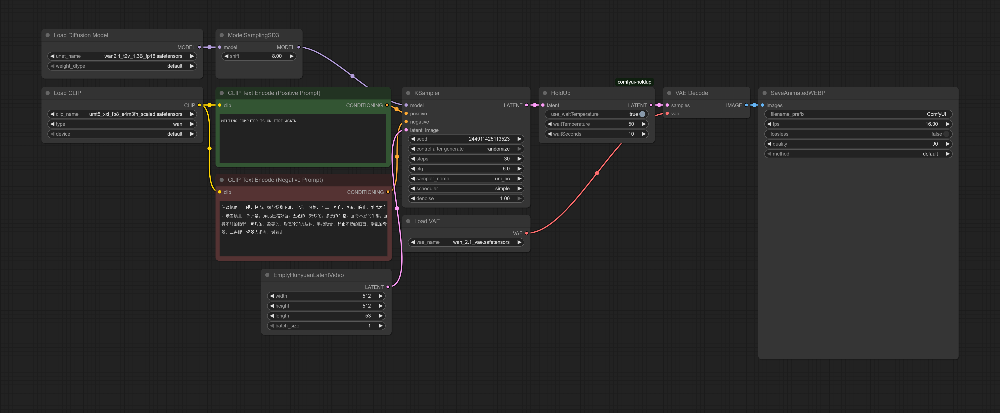
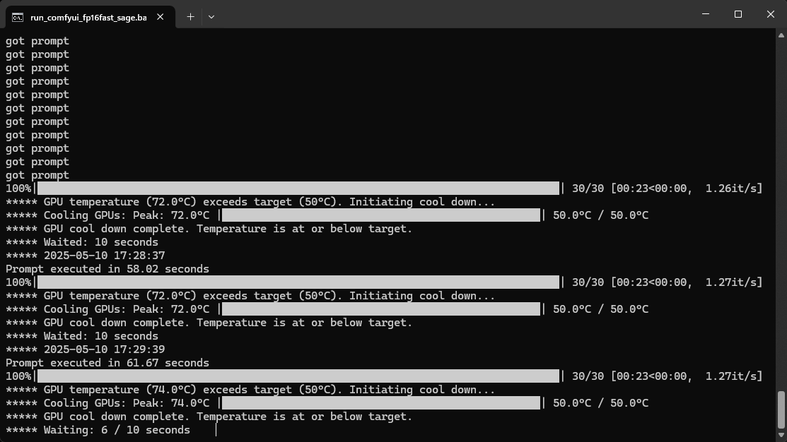
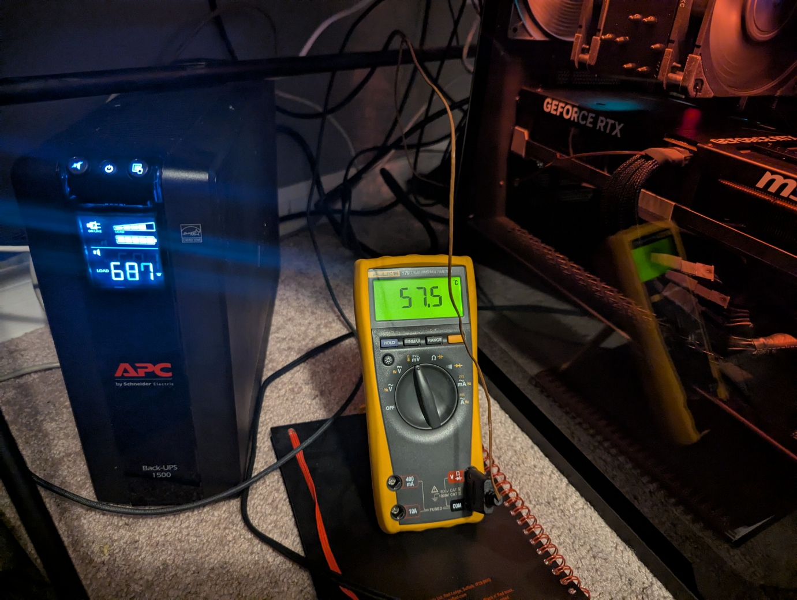

## HoldUp
A ComfyUI node that waits for a GPU temp and/or a number of seconds.

Completely redone but based off of gpucooldown: https://github.com/wmsouza/comfyui-gpucooldown

## Installation
Clone to "custom_nodes"

```
git clone https://github.com/usrname0/comfyui-holdup.git
```

## Usage
Insert it between the KSampler and VAE Decode nodes.

## Pics
Example Wan2.1 workflow (drag image into ComfyUI):


What this looks like in the terminal:


Project inspired by my deep and abiding mistrust of the 12VHPWR connector.

